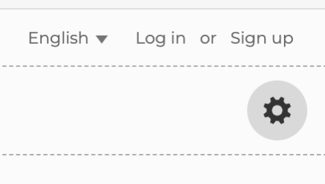
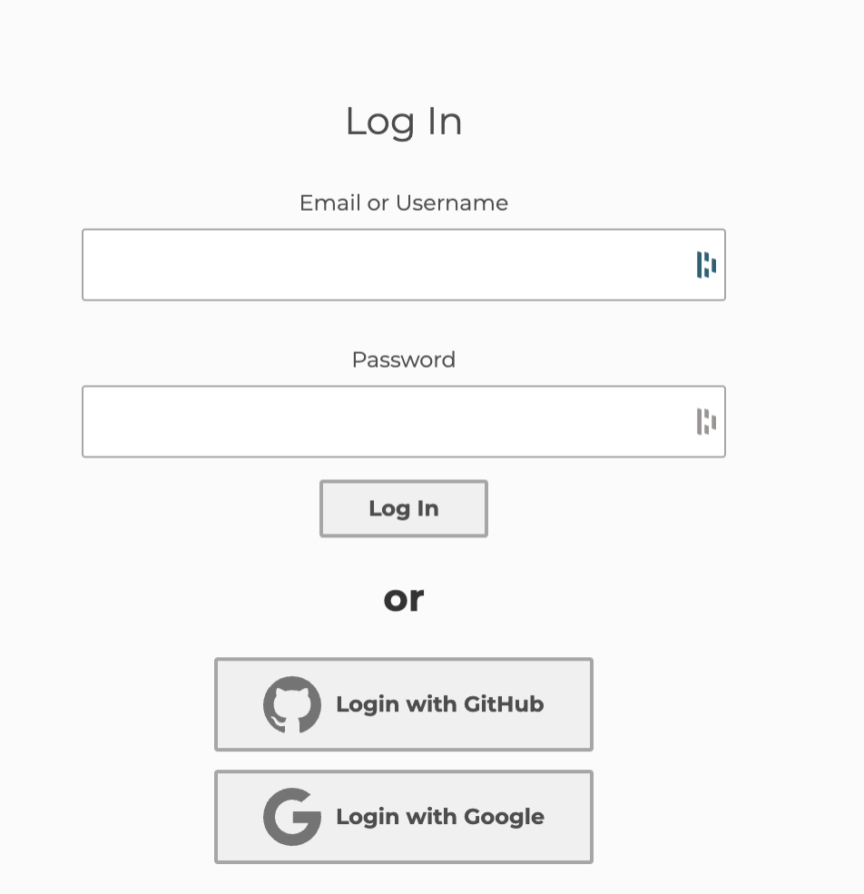

# IntroJs
## Handout 1: Introduction to JavaScript
### What is JavaScript?

JavaScript is a high-level, dynamic programming language primarily used for creating interactive features on websites. It's an essential part of the web development trio: HTML (structure), CSS (style), and JavaScript (behavior).
Unlike HTML and CSS, which are markup and style sheet languages respectively, JavaScript is a true programming language that enables you to implement complex features on web pages.
JavaScript Capabilities:

+ **Client-Side Operations**: JavaScript runs in the user's web browser and can be used to control webpage behavior, validate forms, create cookies, and more.

+ **Server-Side Development**: With environments like Node.js, JavaScript can also be used for backend development.
#### Why Learn JavaScript?

It's one of the most popular programming languages globally.
Essential for web development and has a wide range of applications, from web apps to game development.

### Handout 2: Basic JavaScript Program
#### Variables in JavaScript:

+ Used to store data values. JavaScript uses let, const, and var for variable declarations.
let allows you to declare variables that are limited to the scope of a block statement.
const is used to declare variables whose values cannot be reassigned.
Creating Interactive Web Elements:

+ JavaScript interacts with HTML/CSS to manipulate webpage content.
Example: Drawing a circle that follows the mouse.
canvas element in HTML is used as a drawing surface.
addEventListener listens for mouse movement.
getContext and arc methods of the canvas are used to draw.
#### Sample Program:

Open p5js editior;

https://editor.p5js.org/

log in with your google account





started code:

```

function setup() {
  createCanvas(400, 400);
  
  //Inialize variable 
  //xPos = 100

}

function draw() {
  background(220);
  
  //xPos = mouseX
  
  ellipse(100, 100, 55, 55);
}
```

full code
```
var xPos
var yPos

function setup() {
  createCanvas(400, 400);
  
  //Inialize variable 
  xPos = 100
  yPos = 100
}

function draw() {
  background(220);
  
  xPos = mouseX
  yPos = mouseY
  
  ellipse(xPos, yPos, 55, 55);
}

```

Detailed code explanation that demonstrates creating a canvas and drawing a circle that follows the mouse cursor.
### Handout 3: Introduction to Object-Oriented Programming (OOP)
#### What is OOP?

+ A programming paradigm based on the concept of "objects", which can contain data and code: data in the form of fields (often known as attributes), and code, in the form of procedures (often known as methods).
Key Concepts in OOP:

+ Class: Template for creating objects, providing initial values for state (member variables) and implementations of behavior (member functions or methods).
Object: Instance of a class. An object in JavaScript is a standalone entity, with properties and type.
Encapsulation:

+ Encapsulation is the bundling of data and the methods that operate on that data under a single unit or class. It restricts direct access to some of an object's components, which is a means of preventing accidental interference and misuse of the methods and data.
### Handout 4: Refactoring into a Class
From Functions to Classes:

+ Transitioning from a simple function-based approach to a class-based approach. This involves encapsulating functionality within a class.
Creating a Class in JavaScript:

```
class Circle {
  constructor(x, y) {
    this.x = x;
    this.y = y;
    this.size = 50; // Set the size of the circle
  }

  // The draw function to display the circle
  draw() {
    fill('blue');
    noStroke();
    ellipse(this.x, this.y, this.size * 2, this.size * 2); // p5.js uses diameter for the ellipse size
  }
}

let canvas = document.getElementById('myCanvas');
let circle = new Circle(canvas);
```

Detailed explanation of the Circle class example, breaking down the constructor and methods like updateMousePosition and draw.

Now we start to use the class in our p5js code:

```
// Define the Circle class in p5.js
class Circle {
  constructor(x, y) {
    this.x = x;
    this.y = y;
    this.size = 50; // Set the size of the circle
  }

  // The draw function to display the circle
  draw() {
    fill('blue');
    noStroke();
    ellipse(this.x, this.y, this.size * 2, this.size * 2); // p5.js uses diameter for the ellipse size
  }
}

// Create a global circle object
let circle;

function setup() {
  createCanvas(windowWidth, windowHeight);
  // Initialize the circle object with some starting coordinates
  circle = new Circle(width / 2, height / 2);
}

function draw() {
  background(255);

  // Update the circle's position to the mouse coordinates
  circle.x = mouseX;
  circle.y = mouseY;

  // Draw the circle
  circle.draw();
}


```


Advantages of Using Classes:

**Organizes code**: easier to read, maintain, and debug.
Reusability: once a class is written, it can be used to create numerous objects.
Conclusion and Further Resources
Recap and Encouragement:

JavaScript is a versatile language with wide-ranging applications.
Encourage students to experiment with code and build their own small projects.
Resources for Further Learning:

**MDN Web Docs**: Comprehensive resource for learning JavaScript.
Online Tutorials and Courses: Websites like Codecademy, freeCodeCamp, and others offer interactive JavaScript courses.
JavaScript Frameworks: As students advance, they can explore frameworks like React, Angular, and Vue.js for more complex applications.Introduction to Java Script

## Lets get started

https://github.com/BenjiCoder24/IntroJs/blob/main/code/processing.js


